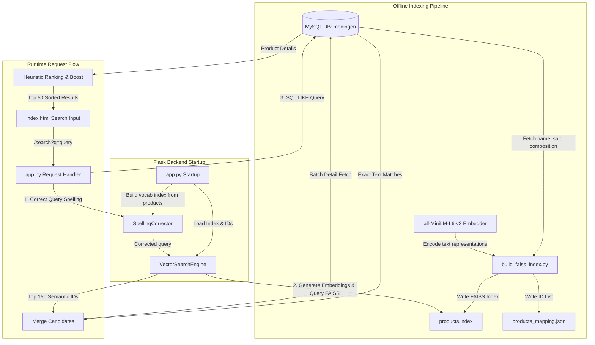

# Medingen Vector Search - Project Architecture & Flow

This document details the step-by-step workflow of the Medingen Vector Search project. The system combines deep learning semantic search, spelling correction, exact database matching, and heuristic re-ranking to deliver highly relevant medical search results.

---

## 1. System Architecture Overview

The system is divided into two primary phases: **Offline Indexing** and **Online Query Processing**.



---

## 2. Step-by-Step Execution Flow

### A. Offline Phase (Indexing & Embedding Ingestion)
Executed via [build_faiss_index.py](file:///m:/Vector_search/Backend/build_faiss_index.py):
1. **Database Connection:** Connects to the local MySQL server and selects the `medingen` database.
2. **Retrieve Data:** Fetches `product_id`, `name`, `salt_name`, and `composition` from the `products` table where the product name is not empty.
3. **Concatenate Text:** For each product, combines fields into a single text representation: `"name - salt_name - composition"`.
4. **Generate Vector Embeddings:** Uses the `all-MiniLM-L6-v2` SentenceTransformers model to transform combined text representations into 384-dimensional dense vectors.
5. **Normalization & FAISS Indexing:**
   - Normalizes all vectors to unit length (L2 norm = 1.0) so that subsequent dot-product searches compute cosine similarity.
   - Adds normalized vectors into a FAISS `IndexFlatIP` (Inner Product index).
6. **Save Index:** Writes the FAISS index to [products.index](file:///m:/Vector_search/Backend/products.index) and product ID sequence mapping to [products_mapping.json](file:///m:/Vector_search/Backend/products_mapping.json).

### B. Startup Phase (Flask Backend Initializations)
Executed on starting [app.py](file:///m:/Vector_search/Backend/app.py):
1. **Load Models:** Initiates `VectorSearchEngine` which loads the SentenceTransformer model and the binary FAISS index/IDs mapping.
2. **Build Vocabulary:** Queries the local MySQL database for all product names and salt names to build an in-memory spellcheck vocabulary dictionary in [spelling.py](file:///m:/Vector_search/Backend/spelling.py), grouping terms by first letter and length for optimized lookups.

### C. Runtime Request Phase (User Searching)
When a request hits `/search?q=query`:
1. **Spelling Correction:**
   - Words are tokenized. Words with length $\ge 3$ not in the vocabulary or the stopword list are checked.
   - Evaluates potential candidates starting with the same character and length within $\pm 2$ range.
   - Selected using Python's `difflib.get_close_matches` with a minimum similarity threshold of `0.7`.
2. **Semantic Retrieve (FAISS Search):**
   - The corrected query is encoded into a 384-dim vector using `SentenceTransformer`.
   - The normalized query vector is queried against the FAISS index to fetch the top `150` matches.
3. **Exact Text Retrieve (LIKE Match):**
   - Parallelly queries the database for exact matches via SQL `LIKE` statement on product name or salt name:
     ```sql
     SELECT product_id FROM products WHERE name LIKE %s OR salt_name LIKE %s LIMIT 100
     ```
4. **Candidate Merging:**
   - Combines semantic candidate IDs with exact text matches to ensure critical exact matches are not missed if semantic scoring ranks them lower.
5. **Details Fetching:**
   - Queries database records in batch for merged IDs:
     ```sql
     SELECT product_id, name, salt_name, composition, photo, product_name_url, product_pricing_new 
     FROM products WHERE product_id IN (...)
     ```
6. **Heuristic Boosting & Re-ranking:**
   Calculates a final match ranking boost score based on the matching hierarchy:
   | Matching Condition | Boost Score | Display Score |
   | :--- | :---: | :---: |
   | Product name **starts with** corrected query | **110** | 1.00 |
   | Product name **starts with** original query | **100** | 1.00 |
   | Product name **contains** corrected query | **90** | 0.99 |
   | Product name **contains** original query | **80** | 0.99 |
   | Salt name **contains** corrected or original query | **60** | 0.99 |
   | Composition **contains** corrected or original query | **40** | 0.88 |
   | Pure semantic match (FAISS score $\ge 0.45$) | **20** | 0.88 |
   | Pure semantic match (FAISS score $\ge 0.30$) | **10** | 0.50 |
   | Weak semantic match (FAISS score $< 0.30$) | **0** | 0.20 |

   *Results are sorted by `(Boost Score, FAISS score)` descending, and the top 50 results are returned.*

### D. Frontend Presentation (User Interface)
Rendered via [index.html](file:///m:/Vector_search/Backend/static/index.html):
1. **Autocomplete Suggestion Panel:**
   - While typing, input event fires a debounced request to `/search`.
   - Results are presented in an autocomplete dropdown split into 3 distinct columns: **Product Name**, **Salt Name**, and **Composition**.
2. **Search Results Grid:**
   - Renders product cards.
   - Automatically filters out items with invalid or missing pricing (i.e. `price <= 0` or missing).
   - Renders matching percentage (`score * 100`) badge.
3. **Details Modal:**
   - Clicking a card displays a detailed pop-up overlay containing detailed indications, specifications, salt description, rating, and prices.
